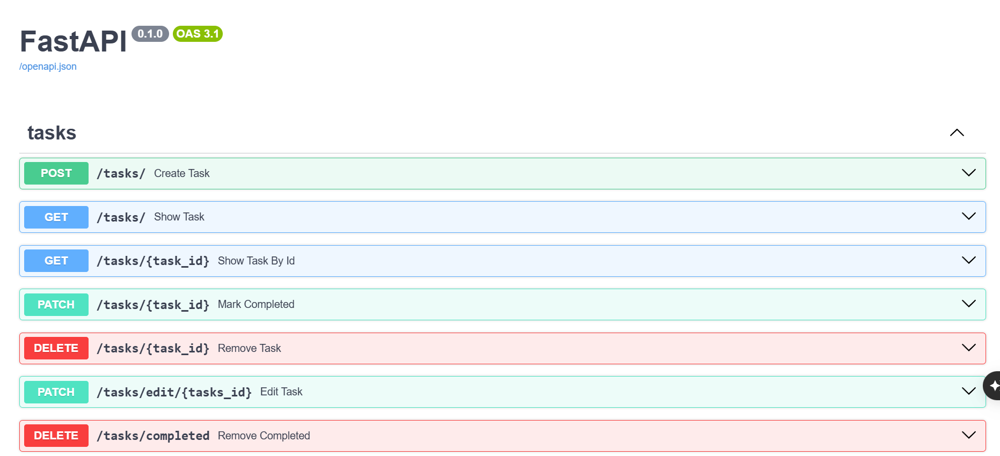

#  Todo API

A RESTful Todo API built with **FastAPI**, **SQLAlchemy 2.0**, and **SQLite** for efficient task management. The API supports CRUD operations, filtering, sorting, partial updates, and clean RESTful design.

---

##  Features

- Create new tasks
- Retrieve all tasks
- Retrieve a task by ID
- Update existing tasks
- Mark tasks as completed
- Delete individual tasks
- Delete all completed tasks
- Search tasks by name
- Filter tasks by:
  - Priority
  - Completion status
  - Due date
  - Tasks without a due date
- Sort tasks by:
  - Task name
  - Priority
  - Due date
  - Completion status
- Request validation using Pydantic
- Proper HTTP status codes and exception handling
- Interactive API documentation with Swagger UI

---

##  Tech Stack

- Python 3.11
- FastAPI
- SQLAlchemy 2.0
- SQLite
- Pydantic v2 
- Uvicorn

---

##  Project Structure

```text
todo/
├── assets/
│   └── swagger.png
├── routes/
│   └── tasks.py
├── database.py
├── schemas.py
├── main.py
├── requirements.txt
├── .gitignore
└── README.md
```

---

##  Installation

Clone the repository:

```bash
git clone https://github.com/qw3rty-dev/fastapi-todo-api.git
```

Navigate to the project directory:

```bash
cd fastapi-todo-api
```

Create a virtual environment:

```bash
python -m venv venv
```

Activate the virtual environment.

**Windows**

```bash
venv\Scripts\activate
```

**Linux/macOS**

```bash
source venv/bin/activate
```

Install dependencies:

```bash
pip install -r requirements.txt
```

Run the development server:

```bash
uvicorn main:app --reload
```

---
## API Endpoints

| Method | Endpoint | Description |
|--------|----------|-------------|
| POST | /tasks | Create a task |
| GET | /tasks | Retrieve all tasks |
| GET | /tasks/{task_id} | Retrieve a task by ID |
| PATCH | /tasks/edit/{task_id} | Update a task |
| DELETE | /tasks/{task_id} | Delete a task |
| DELETE | /tasks/completed | Delete all completed tasks |

---


##  API Documentation

Once the server is running, open:

```text
http://127.0.0.1:8000/docs
```

to access the interactive Swagger UI.

---

##  Preview



---


## Example Queries

GET /tasks?priority=high

GET /tasks?completed=true

GET /tasks?sort=priority&descending=true

GET /tasks?task_name=study

GET /tasks?show_null_due_date=true

---


##  API Capabilities

- CRUD operations
- Dynamic filtering using query parameters
- Dynamic sorting
- Partial updates (PATCH)
- Pydantic request & response models
- Enum-based priority validation
- SQLAlchemy 2.0 ORM
- Session management
- Dynamic query construction
- Response validation using Pydantic
- SQLite database integration

---

##  Future Improvements

- JWT Authentication
- User authentication & authorization
- Pagination
- Docker support
- Automated testing
- PostgreSQL support

---
